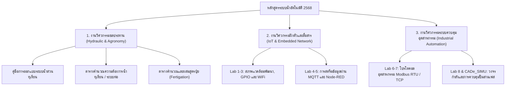

# สรุปโครงสร้างและเนื้อหาโฟลเดอร์หลักสูตร "หลักสูตรระบบน้ำอัตโนมัติ 2568"

จากการเข้าถึงและวิเคราะห์ข้อมูลในระบบจัดเก็บไฟล์ระบบคลาวด์ (Cloud Storage) ของกูเกิลไดรฟ์ (Google Drive) ที่ลิงก์ [หลักสูตรระบบน้ำอัตโนมัติ 2568](https://drive.google.com/drive/folders/14oLYSkXsdZwAqxuKL9KnVnb3PBtrZ7mC?usp=sharing) ทางคณะผู้จัดทำได้จัดหมวดหมู่ วิเคราะห์เชิงลึก และเรียบเรียงสรุปเนื้อหาทางวิชาการและวิศวกรรมเกษตรอัจฉริยะไว้อย่างเป็นระบบ โดยแบ่งเนื้อหาออกเป็นโครงสร้างหลักและนำมาบูรณาการร่วมกับตำราวิชาการวิศวกรรมเกษตรดิจิทัลอัจฉริยะ (รศ. Standard) ดังรายละเอียดต่อไปนี้

---

## 📂 1. โครงสร้างโฟลเดอร์และแคตตาล็อกไฟล์ (Folder Structure & File Catalog)

โฟลเดอร์หลักนี้ประกอบไปด้วยเอกสารแผนการสอน สื่อการบรรยาย คู่มือวิชาการ และโฟลเดอร์ย่อย (Subfolder) อีก 3 โฟลเดอร์ที่รวบรวมทรัพยากรการเรียนรู้ภาคปฏิบัติและเครื่องมือเชิงเทคนิคไว้อย่างครบถ้วน:

### 📄 ไฟล์ในโฟลเดอร์หลัก (Root Directory Files)
เอกสารแกนกลางสำหรับการวางโครงสร้างการสอนและคู่มืออ้างอิงเชิงวิศวกรรมชลประทาน:
1. **คู่มือการออกแบบระบบน้ำในสวนทุเรียน(4).docx** (ขนาด 17.5 KB)
   * คู่มือเทคนิคเฉพาะทางในการวางระบบชลประทานระดับแปลงปลูกสำหรับทุเรียน
2. **แผนการสอนหลักสูตรการติดตั้งระบบน้ำอัตโนมัติ (วันที่ 1 ภาคเช้า-บ่าย).pdf** (ขนาด 107 KB)
   * โครงสร้างกำหนดการเรียนรู้และขอบเขตวิชาการสำหรับวันแรกของการฝึกอบรม
3. **แผนการสอนหลักสูตรการติดตั้งระบบน้ำอัตโนมัติ (วันที่ 2 ภาคเช้า-บ่าย).pdf** (ขนาด 71 KB)
   * โครงสร้างกำหนดการเรียนรู้และรายละเอียดภาคปฏิบัติสำหรับวันที่สอง
4. **แผนการสอนหลักสูตรการติดตั้งระบบน้ำอัตโนมัติ (วันที่ 3-4 ภาคเช้า-บ่าย).pdf** (ขนาด 80 KB)
   * แผนปฏิบัติการเชิงบูรณาการและการทดสอบทักษะรวมกลุ่มในวันที่สามและสี่
5. **วันที่ 1-เอกสารประกอบบรรยายหลักสูตรระบบน้ำ.pdf** (ขนาด 293.6 MB)
   * เอกสารและสไลด์เนื้อหาวิชาการหลักด้านฟิสิกส์การชลประทาน สถาปัตยกรรมเซ็นเซอร์ และการคำนวณเบื้องต้น
6. **วันที่ 2-เอกสารประกอบบรรยายหลักสูตรระบบน้ำ.pdf** (ขนาด 37.6 MB)
   * สไลด์ประกอบการบรรยายเทคโนโลยีการเขียนโปรแกรมฝั่งไคลเอนต์ (Client) และโปรโตคอลระบบควบคุมอุตสาหกรรม

---

### 📂 โฟลเดอร์ย่อยที่ 1: ปฏิบัติการ (Lab Exercises Folder)
*พิกัดโฟลเดอร์ ID: `1ThgP6MQ-_1RupdMRT0TOo8YF1cX8qctb`*
ประกอบด้วยเอกสารคู่มือการเรียนรู้ภาคปฏิบัติ (Lab Sheets) จำนวน 8 หัวข้อหลัก ครอบคลุมทั้งไฟล์เอกสารประมวลผลคำ (Word Document) และรูปแบบเอกสารพกพา (Portable Document Format หรือ PDF):
1. **Lab 1 - ติดตั้งโปรแกรม (.docx / .pdf)**: การจัดเตรียมสภาพแวดล้อมการพัฒนาซอฟต์แวร์ฝังตัว (Embedded Software Development Environment)
2. **Lab 2 - การควบคุมอุปกรณ์เอาท์พุท (.docx / .pdf)**: วิศวกรรมควบคุมแอคชูเอเตอร์ (Actuator Control) หรืออุปกรณ์ขับเคลื่อนทางกายภาพ เช่น รีเลย์และวาล์วไฟฟ้า
3. **Lab 3 - เชื่อมต่อ WiFi (.docx / .pdf)**: การจัดการการเชื่อมต่อโครงข่ายไร้สายผ่านไมโครคอนโทรลเลอร์ (Microcontroller Wireless Connectivity)
4. **Lab 4 - การโปรแกรม MQTT (.docx / .pdf)**: การประยุกต์ใช้โปรโตคอลการลำเลียงข้อมูลน้ำหนักเบาเอ็มคิวทีที (Message Queuing Telemetry Transport หรือ MQTT) สำหรับระบบอินเทอร์เน็ตของสรรพสิ่ง (Internet of Things หรือ IoT)
5. **Lab 5 - การโปรแกรม NodeRed (.docx / .pdf)**: การพัฒนาแผงควบคุมการทำงานแบบกราฟิกผ่านเครื่องมือโหนด-เรด (Node-RED Workflow Tool)
6. **Lab 6 - โปรแกรม Modbus Poll (.docx / .pdf)**: วิธีการใช้งานซอฟต์แวร์ทดสอบและจำลองตัวหลักมอดบัส (Modbus Poll Master Simulator)
7. **Lab 7 - โปรแกรมอุปกรณ์ Modbus (.docx / .pdf)**: วิศวกรรมระบบบัสระดับอุตสาหกรรมและการเขียนโปรแกรมรับส่งข้อมูลผ่านโปรโตคอลมอดบัส (Modbus Protocol)
8. **Lab 8 - โปรแกรม CADe_SIMU (.docx / .pdf)** และ **Lab 8 - โปรแกรม CadSims.docx**: การสร้างแบบจำลองและการวิเคราะห์วงจรกำลังและวงจรควบคุมมอเตอร์ปั๊มน้ำ

---

### 📂 โฟลเดอร์ย่อยที่ 2: โปรแกรมคำนวณ (Calculation Sheets Folder)
*พิกัดโฟลเดอร์ ID: `1p8j8q0mwYtkL5FfLfc55scCOjKBlK6uQ`*
ตารางคำนวณเชิงวิศวกรรมชลประทานเกษตรด้วยไฟล์สเปรดชีต (Spreadsheet):
1. **คำนวณปริมาณความต้องการน้ำของทุเรียน.xlsx**
   * โมเดลคำนวณดัชนีปริมาณความต้องการน้ำอิงตามสภาพภูมิอากาศและช่วงอายุการเจริญเติบโตของพืช
2. **คำนวณสูตรปุ๋ย.xlsx**
   * ตัวช่วยประมวลผลสูตรผสมปุ๋ยเคมี (Fertilizer Blending) เพื่อการให้ปุ๋ยระบบน้ำเชิงอัจฉริยะ
3. **คำนวนระบบท่อน้ำ.xlsx**
   * แผ่นคำนวณการสูญเสียแรงดันเนื่องจากความเสียดทาน (Friction Loss) อัตราการไหล และขนาดเส้นผ่านศูนย์กลางท่อส่งน้ำหลักและท่อย่อย

---

### 📂 โฟลเดอร์ย่อยที่ 3: Software (Installation Packages Folder)
*พิกัดโฟลเดอร์ ID: `1Wivjbn1b4-xxaCSprKKkVs4CUw3HkQvt`*
ซอฟต์แวร์และแอปพลิเคชันเชิงอุตสาหกรรมที่ใช้ควบคู่ในหลักสูตร:
1. **CADe_SIMU V4.zip**
   * โปรแกรมจำลองและออกแบบวงจรไฟฟ้ากำลังและชุดควบคุมตรรกะโปรแกรมเมเบิล (Programmable Logic Controller หรือ PLC)
2. **[plc247.com]Modbus_Poll_9.5.rar** และ **[plc247.com]Modbus_Poll_9.5(1).rar**
   * ชุดโปรแกรมสำหรับใช้ทำแบบจำลองเชื่อมต่อและตรวจสอบเฟรมข้อมูลระบบบัสอุตสาหกรรมด้วยโปรโตคอล Modbus RTU / TCP

---

## 🔍 2. สรุปรายละเอียดเชิงวิชาการของแต่ละส่วนปฏิบัติการ (Academic Deep Dive)

เมื่อวิเคราะห์รายละเอียดและจุดมุ่งหมายเชิงการเรียนรู้ของหลักสูตรนี้ พบว่าการออกแบบหลักสูตรเน้นการ **พัฒนาทักษะวิชาชีพวิศวกรรมเกษตรแบบครบวงจร (Full-Stack Agricultural Engineering)** ตั้งแต่รากฐานระบบชลประทานทางฟิสิกส์ ตลอดจนสถาปัตยกรรมควบคุมดิจิทัลในรูปแบบดิจิทัลสตรีม (Digital Stream):

### 💧 2.1 ภาคทฤษฎีและการคำนวณทางปฐพี-อุทกวิทยา (Soil-Water-Plant Relationship & Calculations)
*   **การประเมินความต้องการน้ำของทุเรียน:** มุ่งเน้นการหาค่าการคายระเหยน้ำอ้างอิงของพืช (Reference Evapotranspiration หรือ $ET_0$) ร่วมกับค่าสัมประสิทธิ์พืช ($K_c$) ในทุเรียนแต่ละช่วงการเจริญเติบโต เช่น ระยะเตรียมต้น ระยะดึงใบ ระยะออกดอก และระยะพัฒนาผล เพื่อกำหนดเวลาและปริมาณการให้น้ำอัจฉริยะตามความจุความชื้นที่เป็นประโยชน์ในดิน (Available Water Capacity)
*   **วิศวกรรมอุทกศาสตร์ระดับแปลงปลูก (On-farm Hydraulics):** ใช้ตารางคำนวณการไหลเพื่อคำนวณการสูญเสียพลังงานในท่อ (Head Loss) ด้วยสูตร Hazen-Williams เพื่อเลือกขนาดท่อน้ำ ขนาดเครื่องสูบน้ำ (Water Pump Horsepower) และความดันใช้งานของหัวจ่ายน้ำ (Emitter Operating Pressure) ให้เกิดความสม่ำเสมอในการกระจายน้ำ (Distribution Uniformity) ทั่วทั้งสวนทุเรียน
*   **การออกแบบการให้ปุ๋ยผ่านระบบน้ำ (Fertigation Technology):** ตารางคำนวณผสมสูตรปุ๋ยช่วยให้เกษตรกรคำนวณอัตราส่วนความต้องการธาตุอาหารหลัก (ไนโตรเจน-N, ฟอสฟอรัส-P, โพแทสเซียม-K) ให้สอดรับกับปริมาณน้ำที่จ่าย เพื่อลดการสูญเสียปุ๋ยจากการซึมลึกเกินเขตรากและเพิ่มประสิทธิภาพการดูดซึม

### 🔌 2.2 ภาคการพัฒนาอุปกรณ์เชื่อมต่อและไอโอที (IoT & Embedded Systems)
*   **สถาปัตยกรรมทางฮาร์ดแวร์ฝังตัว (Embedded Hardware Architecture):** ปฏิบัติการที่ 1-3 ปูพื้นฐานการจัดเตรียมโปรแกรมคอมไพเลอร์ (Compiler Environment Setup) การเขียนโครงสร้างคำสั่งควบคุมวงรอบ (Control Loop) เพื่อเข้าอ่านค่าเซ็นเซอร์ทางกายภาพ และการควบคุมลอจิกพอร์ตสัญญาณขาออกดิจิทัล (GPIO Out) เพื่อขับเคลื่อนโซลินอยด์วาล์ว (Solenoid Valve)
*   **โปรโตคอลการลำเลียงข้อมูลแบบเบา (Lightweight IoT Protocol):** ปฏิบัติการที่ 4 พัฒนาความรู้เรื่อง MQTT ซึ่งเป็นกระดูกสันหลังของการเชื่อมโยงเครือข่ายเซ็นเซอร์ในไร่นา โดยฝึกอบรมการตั้งค่าเครื่องบริการโบรกเกอร์ (Broker) การเผยแพร่ข้อมูล (Publishing) ค่าสถานะดินและอากาศ ตลอดจนการสมัครรับข้อมูล (Subscribing) คำสั่งเปิดปิดน้ำจากภายนอก
*   **การสร้างระบบเฝ้าดูหน้าจอกราฟิก (Dashboard visualization):** ปฏิบัติการที่ 5 ใช้ Node-RED เป็นเครื่องมือสร้างแผงควบคุมระบบ (Agri-Dashboard) โดยการลากวางบล็อกการประมวลผล เพื่อแปลงข้อมูลที่รับจากโปรโตคอล MQTT มาสร้างกราฟจำลองแนวโน้มความชื้นดินแบบเวลาจริง (Real-time soil moisture trends) และสร้างปุ่มสวิตช์สัมผัสควบคุมระยะไกล

### 🏗️ 2.3 ภาควิศวกรรมระบบควบคุมอุตสาหกรรม (Industrial-Grade Automation)
*   **มาตรฐานโปรโตคอลสื่อสารอุตสาหกรรม (Modbus Communication Standard):** ปฏิบัติการที่ 6 และ 7 เป็นขั้นการเรียนรู้ที่สำคัญในการใช้ Modbus RTU ผ่านการสื่อสารแบบอนุกรมอาร์เอส-485 (RS-485 Serial Communication) และ Modbus TCP เพื่อความทนทานต่อสัญญาณรบกวนระยะไกลในแปลงเกษตรขนาดใหญ่ นักเรียนจะได้ใช้ซอฟต์แวร์ Modbus Poll ในการจำลองการอ่านเขียนรีจิสเตอร์ (Registers Reading/Writing)
*   **การออกแบบและการจำลองระบบกำลัง (Power & Motor Control Simulation):** ปฏิบัติการที่ 8 ประยุกต์ใช้โปรแกรม CADe_SIMU V4 เพื่อสอนให้ผู้เรียนเข้าใจสถาปัตยกรรมตู้ควบคุมไฟฟ้า (Control Panel Board) การติดตั้งระบบแมกเนติกคอนแทกเตอร์ (Magnetic Contactor) ตัวป้องกันมอเตอร์โอเวอร์โหลด (Overload Relay) และวงจรสวิตช์ปุ่มกดฉุกเฉิน (Emergency Switch) สำหรับควบคุมปั๊มน้ำแรงดันสูงสามเฟสที่ใช้งานจริงในระบบชลประทานขนาดใหญ่

---

## 🤝 3. การประสานความรู้ (Alignment) ร่วมกับตำราวิชาการวิศวกรรมเกษตรดิจิทัลอัจฉริยะ

เนื้อหาและไฟล์ปฏิบัติการในกูเกิลไดรฟ์ชุดนี้ สอดประสานและเชื่อมโยงเข้าเป็นหนึ่งเดียวกับ **ตำราวิชาการเกษตรดิจิทัลอัจฉริยะ (รศ. Standard)** ที่พวกเราได้ร่วมกันพัฒนาขึ้นมาอย่างสมบูรณ์แบบ โดยมีจุดเชื่อมต่อทางทฤษฎีและซอร์สโค้ดตัวอย่างที่รองรับในบทเรียนต่างๆ ดังนี้:

| 📂 หัวข้อเอกสารจากกูเกิลไดรฟ์ | 📘 บูรณาการกับบทเรียนในตำราวิชาการ | 💡 รายละเอียดการประสานประโยชน์และความเชื่อมโยงเชิงวิชาการ |
| :--- | :--- | :--- |
| **คู่มือการออกแบบระบบน้ำในสวนทุเรียน(4).docx** | **บทที่ 14 & 15** | นำทฤษฎีความสัมพันธ์ระหว่างดิน น้ำ และพืช (Soil-Water-Plant Relations) มาขยายความคู่กับสูตรการให้น้ำทุเรียน และสถาปัตยกรรมการจ่ายปุ๋ยผสมน้ำอัจฉริยะ |
| **ตารางคำนวณความต้องการน้ำของทุเรียน.xlsx** | **บทที่ 14 (คู่แฝดดิจิทัล)** | การคำนวณ $ET_0$ ในสเปรดชีตสอดคล้องกับสมการ **FAO-56 Penman-Monteith** และสมการประมาณการคายระเหยน้ำเชิงฟิสิกส์ ที่อธิบายอย่างลึกซึ้งในตำราวิชาการ พร้อมโค้ดจำลองระดับอุดมศึกษา |
| **ตารางคำนวนระบบท่อน้ำ.xlsx** | **บทที่ 15 (ระบบอัตโนมัติ)** | ปรากฏลอจิกการคำนวณการสูญเสียแรงดันตามกฎชลศาสตร์ ซึ่งรองรับระบบแจ้งเตือนกรณีท่อน้ำชำรุดหรือแตกเสียหาย (Fail-safe detection) ในซอร์สโค้ดระดับสูงของบทที่ 15 |
| **ตารางคำนวณสูตรปุ๋ย.xlsx** | **บทที่ 15 (ระบบอัตโนมัติ)** | เป็นรากฐานข้อมูลนำเข้าในการเขียนโค้ดระบบให้น้ำผสมปุ๋ย (Fertigation Control System) ที่มีการปรับปรุงสูตรตามระยะการเติบโต |
| **Lab 1 - ติดตั้งโปรแกรม** | **บทที่ 2 (วิศวกรรมภาษาคอมพิวเตอร์)** | พื้นฐานการติดตั้งซอฟต์แวร์เขียนโค้ด (IDE Setup) และภาษา C/C++ สำหรับนักเรียนมัธยมศึกษาตอนต้น |
| **Lab 2 - การควบคุมอุปกรณ์เอาท์พุท** | **บทที่ 12 (วิศวกรรมเซ็นเซอร์)** | การเชื่อมต่อตัวแปลงค่าเชิงกายภาพและวงจรขับระดับกระแสสูง (Driver & Relay Interfaces) เพื่อสลับสถานะวาล์วไฟฟ้าและปั๊มน้ำ |
| **Lab 3 - เชื่อมต่อ WiFi** | **บทที่ 13 (โปรโตคอลการสื่อสาร)** | การทำงานร่วมกับชิป Wi-Fi ไร้สาย และการจัดการสถาปัตยกรรมโครงข่ายสำหรับสถานีตรวจวัดอากาศระยะไกล |
| **Lab 4 - การโปรแกรม MQTT** | **บทที่ 13 (โปรโตคอลการสื่อสาร)** | อธิบายกลไกการสื่อสารแบบ Publish/Subscribe และการออกแบบโครงสร้างหัวข้อข้อมูล (Topic Structure Design) เชิงอรรถประโยชน์ |
| **Lab 5 - การโปรแกรม NodeRed** | **บทที่ 14 (คู่แฝดดิจิทัล)** | เป็นเครื่องมือชั้นยอดในการสร้างระบบส่วนติดต่อผู้ใช้งาน (User Interface หรือ UI) และการสร้างระบบแสดงผลความชื้นดินแบบกราฟิกจำลอง |
| **Lab 6 & 7 - โปรแกรม Modbus** | **บทที่ 13 & บทที่ 15** | การเชื่อมโยงสถาปัตยกรรมเครือข่ายมอดบัส (Modbus Architecture) บนมาตรฐานบัสอาร์เอส-485 สำหรับงานตรวจจับความชื้นดินหลายความลึก |
| **Lab 8 & CADe_SIMU V4** | **บทที่ 15 (ระบบอัตโนมัติ)** | การเชื่อมโยงทางทฤษฎีจากซอฟต์แวร์จำลองไปสู่ตู้ควบคุมปั๊มน้ำสามเฟสอุตสาหกรรมในแปลงเกษตรของจริง |

---

## 🎯 4. บทสรุปเชิงวิชาการ (Academic Conclusion)

แฟ้มสะสมเอกสารและหลักสูตร **"หลักสูตรระบบน้ำอัตโนมัติ 2568"** นี้มิใช่เพียงแค่เอกสารฝึกอบรมทั่วไป แต่เป็น **แบบพิมพ์เขียวเชิงปฏิบัติการแบบบูรณาการ (Integrated Implementation Blueprint)** ที่มีคุณค่าและพร้อมต่อการนำไปใช้งานจริงอย่างยิ่งยวด มีการออกแบบการเรียนรู้ที่มีลำดับขั้นอย่างมีตรรกวิทยา (Pedagogical Logic) จากลอจิกควบคุมอย่างง่าย ไต่ระดับขึ้นสู่สถาปัตยกรรมการสื่อสารโปรโตคอลและการจำลองระดับอุตสาหกรรม

การมีอยู่ของเอกสารชุดนี้ทำหน้าที่เป็นเสมือน **"ส่วนต่อขยายภาคสนาม (Field Extension Component)"** ที่สมบูรณ์แบบของตำราเรียนวิชาการเกษตรดิจิทัลอัจฉริยะ (รศ. Standard) ที่เราได้เขียนขึ้น ทำให้ทฤษฎีเชิงสมการฟิสิกส์ชั้นสูง (เช่น สมการ Penman-Monteith) และโค้ดการคำนวณเชิงวัตถุ (Object-Oriented Programming) กลายสภาพเป็นตู้ควบคุมวงจรจำลอง ซอฟต์แวร์อ่านค่ารีจิสเตอร์ และแผ่นคำนวณสเปรดชีตที่เกษตรกรและวิศวกรเกษตรใช้ประเมินแปลงพืชจริงกลางแจ้งได้อย่างมีประสิทธิภาพสูงสุด

---
*จัดทำขึ้นโดยคณะผู้จัดทำตำราวิชาการเกษตรดิจิทัลอัจฉริยะ รศ. Standard 2026*
