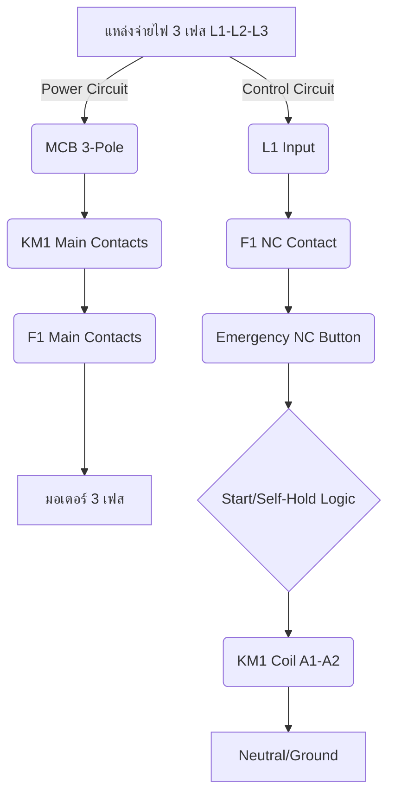

## Lab 8: การเขียนผังและออกแบบแบบจำลองตู้จ่ายไฟปั๊มสูบน้ำ 3 เฟสด้วยโปรแกรม CADe_SIMU V4

# 🎓 Lab 8: การเขียนผังและออกแบบแบบจำลองตู้จ่ายไฟปั๊มสูบน้ำ 3 เฟสด้วยโปรแกรม CADe\_SIMU V4
***
**วิชา:** ฟิสิกส์การเกษตรประยุกต์และระบบชลประทานแม่นยำ (Applied Agricultural Physics and Precision Irrigation Systems)
**ระดับ:** มัธยมศึกษาตอนต้น (STEM Track)
**ผู้สอน:** ปัญญาประดิษฐ์ไอด้า [ชื่อสมมติ] (Elite Thai Professor)
**หัวข้อ:** การควบคุมกำลังไฟฟ้าสูง (High-Power Electrical Control)
***

### 💡 คำนำจากอาจารย์ผู้สอน (Professor's Introduction)

สวัสดีครับนักเรียนที่น่ารักทุกคน! วันนี้เราจะก้าวเข้าสู่หัวข้อที่สำคัญและน่าตื่นเต้นที่สุดหัวข้อหนึ่งในวิชาชลประทานแม่นยำ นั่นคือ **"การควบคุมกำลังไฟฟ้าสูง"** (High-Power Electrical Control)

ถ้าพวกเราเคยเห็นปั๊มน้ำขนาดใหญ่ที่ใช้ในสถานีชลประทานเพื่อสูบน้ำไปรดแปลงทุเรียนหมอนทองขนาดใหญ่ คงจะสงสัยว่า "อะไรที่ทำให้ปั๊มตัวยักษ์นี้ทำงานได้อย่างปลอดภัยและมีประสิทธิภาพ?" คำตอบไม่ได้อยู่ที่ปั๊มอย่างเดียวครับ แต่อยู่ที่ **"สมอง"** และ **"ระบบประสาท"** ที่เราจะออกแบบในวันนี้ นั่นคือ **ตู้ควบคุมไฟฟ้า (Control Panel)**

ในห้องปฏิบัติการนี้ เราจะไม่เพียงแค่ต่อสายไฟเท่านั้น แต่เรากำลังเรียนรู้หลักการทางฟิสิกส์และวิศวกรรมไฟฟ้าที่ทำให้ระบบทั้งหมดทำงานได้อย่างเสถียรและปลอดภัยตามมาตรฐานสากล เราจะใช้โปรแกรมจำลอง (Simulation Program) อย่าง CADe\_SIMU V4 เพื่อให้พวกเราได้เห็นภาพการทำงานของวงจรไฟฟ้ากำลัง (Power Circuit) และวงจรควบคุม (Control Circuit) อย่างชัดเจนที่สุดครับ

---

### 📚 ส่วนที่ 1: ทฤษฎีพื้นฐานและหลักการทางฟิสิกส์ (Theoretical Foundation)

#### 1.1 มอเตอร์ไฟฟ้าแบบเหนี่ยวนำกระแสสลับ 3 เฟส (Three-phase Induction Motor)
**หลักการทางฟิสิกส์:** มอเตอร์ชนิดนี้เป็นหัวใจสำคัญของการสูบน้ำในภาคเกษตรกรรม มันทำงานโดยอาศัยหลักการของ **แม่เหล็กไฟฟ้า (Electromagnetism)** เมื่อเราจ่ายกระแสไฟฟ้ากระแสสลับ (Alternating Current หรือ AC) สามเฟส (Three Phases) เข้าไปที่ขดลวด (Coil) ของมอเตอร์ จะทำให้เกิดสนามแม่เหล็กหมุน (Rotating Magnetic Field) ที่หมุนรอบแกนของมอเตอร์อย่างต่อเนื่อง
**สมการพื้นฐาน:** กำลังไฟฟ้าที่จ่ายให้กับมอเตอร์ (Input Power, $P_{in}$) คำนวณได้จาก:
$$P_{in} = \sqrt{3} \cdot V \cdot I \cdot \cos(\phi)$$
โดยที่:
*   $P_{in}$ คือ กำลังไฟฟ้าที่ป้อนเข้า (หน่วย: วัตต์, W)
*   $\sqrt{3}$ คือ ค่าคงที่ทางวิศวกรรม (ประมาณ 1.732)
*   $V$ คือ แรงดันไฟฟ้าไลน์-ทู-ไลน์ (Line-to-Line Voltage, หน่วย: โวลต์, V)
*   $I$ คือ กระแสไฟฟ้าไลน์ (Line Current, หน่วย: แอมแปร์, A)
*   $\cos(\phi)$ คือ ตัวประกอบกำลัง (Power Factor) ซึ่งบอกประสิทธิภาพการใช้พลังงาน

#### 1.2 องค์ประกอบสำคัญในตู้ควบคุม (Key Components)

| องค์ประกอบ (Component) | หน้าที่ทางวิศวกรรม (Engineering Function) | หลักการทำงาน (Physics Principle) |
| :--- | :--- | :--- |
| **เซอร์กิตเบรกเกอร์ (Circuit Breaker, MCB)** | ป้องกันไฟฟ้าลัดวงจร (Short Circuit) และกระแสเกิน (Overcurrent) ในวงจรหลัก | เมื่อกระแสเกินขีดจำกัดที่กำหนด (Rated Current) ตัวสปริงภายในจะทำงานและตัดวงจรทันที |
| **แมกเนติกคอนแทกเตอร์ (Magnetic Contactor, KM1)** | เป็นสวิตช์ไฟฟ้ากำลังขนาดใหญ่ที่ควบคุมด้วยสัญญาณไฟฟ้าแรงต่ำ (Low Voltage) | ใช้หลักการของ **แม่เหล็กไฟฟ้า (Electromagnetism)** เมื่อจ่ายไฟ $24 \text{ V}$ เข้าขดลวด (Coil) จะเกิดสนามแม่เหล็กดึงหน้าสัมผัส (Contact) ให้ปิดวงจรหลัก ทำให้กระแสสูงไหลผ่านได้ |
| **เทอร์มอลโอเวอร์โหลดรีเลย์ (Thermal Overload Relay, F1)** | ป้องกันมอเตอร์จากกระแสเกินพิกัด (Overload) ที่เกิดจากการทำงานหนักเกินไป (เช่น การสูบน้ำที่แรงดันสูง) | ใช้หลักการ **ความร้อน (Heat)** ภายในตัวรีเลย์ เมื่อกระแสเกิน จะทำให้เกิดความร้อนสะสมสูงเกินไปจนไบเมทัล (Bimetal) โค้งงอและตัดวงจร |
| **ปุ่มกดปิดฉุกเฉิน (Emergency Push Button, NC)** | เป็นสวิตช์ความปลอดภัยสูงสุด (Safety Switch) ที่ต้องตัดไฟทันทีเมื่อเกิดอันตราย | ถูกออกแบบให้เป็นแบบ **Normally Closed (NC)** หมายความว่าในสภาวะปกติวงจรจะปิดอยู่ และเมื่อกด (หรือเกิดการขาด) วงจรจะเปิดออกทันที (Fail-Safe Design) |

---

### 🔌 ส่วนที่ 2: การออกแบบวงจรไฟฟ้า (Circuit Design and Logic Flow)

#### 2.1 แผนผังการไหลของกระแสไฟฟ้า (Circuit Flow Diagram)
เราจะใช้แผนผัง Mermaid เพื่อแสดงการไหลของวงจรทั้งกำลังและควบคุม



#### 2.2 การวิเคราะห์วงจรควบคุมลอจิกสวิตช์ (Control Logic Analysis)

ระบบควบคุมนี้ต้องทำงานตามหลักการ **"ความปลอดภัยต้องมาก่อน" (Safety First)** และ **"การทำงานต้องต่อเนื่อง" (Self-Holding)**

1.  **วงจรควบคุม (Control Circuit):** ใช้แรงดันไฟฟ้าต่ำ (เช่น $24 \text{ V}$ AC) เพื่อจ่ายไฟให้ขดลวดของแมกเนติกคอนแทกเตอร์ (KM1)
2.  **ลำดับการทำงาน (Sequence):**
    *   **Start:** ผู้ใช้กดปุ่ม Start (NO) $\rightarrow$ กระแสไหลผ่านปุ่ม Start $\rightarrow$ ไปจ่ายไฟที่ขดลวด KM1 $\rightarrow$ KM1 ทำงาน (หน้าสัมผัสหลักปิด) $\rightarrow$ มอเตอร์เริ่มหมุน
    *   **Self-Holding (การประคองกระแส):** เมื่อผู้ใช้ปล่อยปุ่ม Start, หน้าสัมผัสช่วย (Auxiliary Contact, NO) ของ KM1 จะทำหน้าที่ "ขนาน" (Parallel) กับปุ่ม Start โดยอัตโนมัติ ทำให้กระแสยังคงไหลผ่านหน้าสัมผัสช่วยนี้ต่อไปได้ แม้ผู้ใช้จะปล่อยมือแล้วก็ตาม
    *   **Stop:** ผู้ใช้กดปุ่ม Stop (หรือในกรณีนี้คือการเปิดวงจร) $\rightarrow$ กระแสที่จ่ายให้ขดลวด KM1 ถูกตัด $\rightarrow$ KM1 คลายตัว (De-energize) $\rightarrow$ หน้าสัมผัสหลักเปิดออก $\rightarrow$ มอเตอร์หยุดทำงาน

**สมการลอจิก (Boolean Logic):**
ให้ $S$ คือสถานะของปุ่ม Start, $E$ คือสถานะของปุ่ม Emergency, $H$ คือสถานะของ Self-Hold Contact, และ $L$ คือสถานะของ Overload Relay
สถานะการทำงานของแมกเนติกคอนแทกเตอร์ ($KM1_{State}$) จะเป็นจริง (True) ก็ต่อเมื่อ:
$$KM1_{State} = L \cdot E \cdot (S + H)$$
*   $L$: ต้องไม่มี Overload (Overload must be OK)
*   $E$: ต้องไม่มี Emergency Trip (Emergency must be OK)
*   $(S + H)$: ต้องมีการกด Start หรือ Self-Hold ทำงาน (Start OR Self-Hold)

---

### 🛠️ ส่วนที่ 3: คู่มือการลากสายในโปรแกรม CADe\_SIMU V4 (Step-by-Step Wiring Guide)

#### 3.1 วงจรกำลังหลัก (Power Circuit)
**วัตถุประสงค์:** นำพลังงาน $3 \text{ เฟส}$ ไปขับเคลื่อนมอเตอร์อย่างปลอดภัย
**ขั้นตอนการลากสาย:**

1.  **แหล่งจ่าย (Source):** ลากสาย $3 \text{ เฟส}$ (L1, L2, L3) เข้าสู่จุดเริ่มต้นของวงจร
2.  **MCB (Circuit Breaker):** ต่อสาย L1-L3 ผ่านเซอร์กิตเบรกเกอร์ 3-Pole (MCB 3-Pole) เพื่อป้องกันกระแสเกินในระดับวงจร
3.  **KM1 (Main Contacts):** ต่อสายจากขั้วออกของ MCB เข้าสู่ขั้วหลัก (Main Contacts) ของแมกเนติกคอนแทกเตอร์ (KM1)
4.  **F1 (Overload Relay):** ต่อสายจากขั้วออกของ KM1 เข้าสู่ขั้วหลัก (Main Contacts) ของรีเลย์ความร้อน (F1)
5.  **Motor:** ต่อสายจากขั้วออกของ F1 เข้าสู่ขั้ว U1-V1-W1 ของมอเตอร์ 3 เฟส

#### 3.2 วงจรควบคุมลอจิกสวิตช์ (Control Circuit)
**วัตถุประสงค์:** สร้างวงจรควบคุมที่ปลอดภัยและสามารถรักษาการจ่ายไฟได้เอง
**ขั้นตอนการลากสาย:**

1.  **แหล่งจ่ายควบคุม (Control Source):** ดึงไฟเฟส L1 (หรือ $24 \text{ V}$ AC) มาเป็นจุดเริ่มต้นของวงจรควบคุม
2.  **F1 NC (Overload Protection):** ต่อสายจาก L1 ผ่านหน้าสัมผัสปกติปิด (Normally Closed, NC) ของ F1 (พอร์ต 95-96) **(สำคัญมาก: ต้องผ่าน NC เสมอ)**
3.  **Emergency NC:** ต่อสายจาก F1 NC เข้าสู่ปุ่มกดฉุกเฉิน (Emergency Push Button) ซึ่งต้องเป็นแบบ NC เสมอ
4.  **Start Button (NO):** ต่อสายจาก Emergency NC เข้าสู่ปุ่ม Start (ปุ่มสีเขียว, Normally Open, NO)
5.  **Self-Holding Contact (Auxiliary NO):** **(หัวใจของระบบ)** ต่อสายจากปุ่ม Start ขนาน (Parallel) กับหน้าสัมผัสช่วยปกติเปิด (Normally Open, NO) ของ KM1 (พอร์ต 13-14)
6.  **KM1 Coil:** ต่อสายจากจุดรวมของ Start/Self-Hold เข้าสู่ขดลวดของ KM1 (A1-A2)
7.  **Neutral:** ปล่อยสาย Neutral (N) กลับมาที่ขั้วอีกด้านของขดลวด KM1 (A2)

---

### 💻 ส่วนที่ 4: การจำลองการทำงานด้วยโค้ด (Code Simulation Logic)

แม้ว่าเราจะใช้โปรแกรมจำลองวงจร (CADe\_SIMU) แต่ในความเป็นจริง ระบบควบคุมนี้จะถูกควบคุมโดย **Programmable Logic Controller (PLC)** หรือ **Microcontroller** (เช่น Arduino) ซึ่งเราต้องเขียนโค้ดเพื่อกำหนดตรรกะการทำงาน

**หลักการความปลอดภัยของโค้ด:**
1.  **Active Low:** การทำงานของรีเลย์ (Relay) จะถูกกำหนดให้เป็น Active Low หมายความว่าเมื่อต้องการให้รีเลย์ทำงาน (ON) เราต้องส่งสัญญาณ $0 \text{ V}$ (LOW) ไปให้มัน
2.  **Initialization:** ต้องกำหนดสถานะเริ่มต้นของ Output ทั้งหมดเป็น HIGH เพื่อให้มั่นใจว่าระบบปลอดภัยก่อนเริ่มทำงาน

#### ตัวอย่างโค้ด C++ สำหรับ Arduino (PLC Logic Simulation)

```cpp
// #include <Arduino.h> // ต้องรวมไลบรารี Arduino
// กำหนดขา Digital Input/Output (สมมติว่าใช้ขาเหล่านี้)

// --- INPUTS (สัญญาณรับเข้า) ---
const int PIN_START_BUTTON = 2;    // ขาสำหรับปุ่ม Start (NO)
const int PIN_EMERGENCY_BUTTON = 3; // ขาสำหรับปุ่ม Emergency (NC)
const int PIN_OVERLOAD_STATUS = 4;  // ขาสำหรับสถานะ Overload (LOW = OK, HIGH = Trip)

// --- OUTPUTS (สัญญาณจ่ายออก) ---
const int PIN_KM1_COIL = 5;        // ขาควบคุมขดลวดแมกเนติกคอนแทกเตอร์ KM1 (Active Low)

// ตัวแปรสถานะ (State Variables)
bool isRunning = false; // สถานะการทำงานของปั๊ม

void setup() {
  // 1. กำหนดโหมดขา (Pin Mode Setup)
  pinMode(PIN_START_BUTTON, INPUT_PULLUP); // ใช้ Internal Pull-up สำหรับปุ่มกด
  pinMode(PIN_EMERGENCY_BUTTON, INPUT_PULLUP);
  pinMode(PIN_OVERLOAD_STATUS, INPUT_PULLUP);
  pinMode(PIN_KM1_COIL, OUTPUT);

  // 2. การตั้งค่าความปลอดภัยเริ่มต้น (Safety Initialization)
  // กำหนดให้ Output ทั้งหมดเป็น HIGH เสมอ (Active Low Logic)
  // หมายความว่า: เมื่อเริ่มระบบ KM1 จะถูกตัดไฟ (OFF) ทันที
  digitalWrite(PIN_KM1_COIL, HIGH); 
  Serial.begin(9600);
  Serial.println("System Initialized: KM1 is OFF (Safe State).");
}

void loop() {
  // 1. อ่านค่าสถานะอินพุต (Read Inputs)
  int startState = digitalRead(PIN_START_BUTTON);
  int emergencyState = digitalRead(PIN_EMERGENCY_BUTTON);
  int overloadState = digitalRead(PIN_OVERLOAD_STATUS);

  // 2. ตรวจสอบเงื่อนไขความปลอดภัย (Safety Check)
  // เงื่อนไขที่ 1: Overload ต้องไม่ Trip (Overload State ต้องเป็น LOW)
  // เงื่อนไขที่ 2: Emergency ต้องไม่ Trip (Emergency State ต้องเป็น LOW)
  // เงื่อนไขที่ 3: ต้องมีการกด Start (Start Button ต้องเป็น LOW เพราะใช้ PULLUP)
  
  bool canRun = (overloadState == LOW) && (emergencyState == LOW) && (startState == LOW);

  // 3. การตัดสินใจควบคุม (Control Logic)
  if (canRun && !isRunning) {
    // ถ้าทุกอย่างพร้อม และปั๊มยังไม่ทำงาน
    // 1. เปิดขดลวด KM1 (Active Low: ต้องส่ง LOW)
    digitalWrite(PIN_KM1_COIL, LOW); 
    isRunning = true;
    Serial.println("--- Pump Started! KM1 Activated. ---");
  } 
  else if (startState == HIGH && isRunning) {
    // ถ้าผู้ใช้ปล่อยปุ่ม Start (Start State กลับไป HIGH)
    // ระบบจะเข้าสู่ Self-Holding Logic (ใน PLC จริง หน้าสัมผัสช่วยจะทำงานแทน)
    // แต่ในโค้ดนี้ เราจะจำลองการหยุดเมื่อมีการกดปุ่ม Stop (สมมติว่ามีปุ่ม Stop แยก)
    // *ในทางปฏิบัติ: ต้องมีปุ่ม Stop แยกเพื่อตัดวงจร*
  }
  else if (overloadState == HIGH || emergencyState == HIGH) {
    // ถ้าเกิด Overload หรือ Emergency Trip
    // 1. ปิดขดลวด KM1 (Active Low: ส่ง HIGH)
    digitalWrite(PIN_KM1_COIL, HIGH); 
    isRunning = false;
    Serial.println("!!! System Trip Detected! KM1 Deactivated. !!!");
  }
  // (ในโค้ดจริง ต้องเพิ่ม Logic สำหรับปุ่ม Stop เพื่อให้ระบบหยุดทำงาน)
  
  delay(50); // หน่วงเวลาเล็กน้อยเพื่อการอ่านค่าที่เสถียร
}
```

---

### 📝 ส่วนที่ 5: แบบฝึกหัดท้ายปฏิบัติการ 8 (Lab 8 Exercises)

**คำชี้แจง:** ให้นักเรียนตอบคำถามและวิเคราะห์วงจรตามหลักการทางฟิสิกส์และวิศวกรรมไฟฟ้า

**คำถามข้อที่ 1: การวิเคราะห์ความปลอดภัย (Safety Analysis)**
หากเราลืมต่อหน้าสัมผัสปกติปิด (NC) ของรีเลย์ความร้อน (F1) เข้ามาในวงจรควบคุม จะเกิดอะไรขึ้นเมื่อมอเตอร์ทำงานหนักเกินไป (Overload)? จงอธิบายตามหลักการทำงานของวงจรไฟฟ้า

**คำถามข้อที่ 2: หลักการ Self-Holding (Self-Latching Logic)**
จงอธิบายว่าทำไมเราจึงต้องต่อหน้าสัมผัสช่วย (Auxiliary Contact) ของแมกเนติกคอนแทกเตอร์ (KM1) มาขนานกับปุ่ม Start? หากไม่มีการต่อวงจรนี้ จะเกิดผลอย่างไรต่อการทำงานของปั๊ม?

**คำถามข้อที่ 3: การคำนวณกำลังไฟฟ้า (Power Calculation)**
สถานีชลประทานใช้ปั๊มสูบน้ำ 3 เฟส โดยมีค่าดังนี้:
*   แรงดันไฟฟ้า (V): $380 \text{ V}$
*   กระแสไฟฟ้า (I): $15 \text{ A}$
*   ตัวประกอบกำลัง ($\cos(\phi)$): $0.85$
จงคำนวณหากำลังไฟฟ้าที่ป้อนเข้ามอเตอร์ (Input Power, $P_{in}$) โดยใช้สูตรที่ได้เรียนมา พร้อมระบุหน่วยให้ถูกต้อง

---

### ✅ เฉลยแบบฝึกหัดท้ายปฏิบัติการ 8 (Answer Key)

**คำตอบข้อที่ 1: การวิเคราะห์ความปลอดภัย**
**คำตอบ:** หากลืมต่อหน้าสัมผัส NC ของ F1 จะทำให้วงจรควบคุมไม่มีการป้องกันการทำงานเกินพิกัด (Overload Protection) เมื่อมอเตอร์ทำงานหนักเกินไป (เช่น มีการอุดตันในท่อ) กระแสไฟฟ้าจะสูงขึ้นอย่างรวดเร็ว แต่เนื่องจากไม่มีการตัดวงจรควบคุม (Control Circuit) แมกเนติกคอนแทกเตอร์ (KM1) จะยังคงจ่ายไฟให้มอเตอร์ต่อไปเรื่อย ๆ ทำให้มอเตอร์ทำงานเกินพิกัดจนเกิดความร้อนสูงมาก อาจนำไปสู่ความเสียหายของมอเตอร์หรือแม้กระทั่งเกิดเพลิงไหม้ได้

**คำตอบข้อที่ 2: หลักการ Self-Holding**
**คำอธิบาย:** หน้าที่ของหน้าสัมผัสช่วย (Auxiliary Contact) คือการทำหน้าที่เป็น "ตัวจำความจำ" (Memory) ของระบบ เมื่อผู้ใช้กดปุ่ม Start (จ่ายไฟให้ KM1) หน้าสัมผัสหลักจะปิดลง และหน้าสัมผัสช่วย (NO) จะถูกดึงให้ปิดตามไปด้วย เมื่อผู้ใช้ปล่อยมือจากปุ่ม Start หน้าสัมผัสช่วยนี้จะยังคงจ่ายไฟให้ขดลวด KM1 ต่อไปได้ ทำให้ปั๊มยังคงทำงานต่อไปได้โดยอัตโนมัติ (Self-Sustaining)
**ผลที่เกิดขึ้นหากไม่มี:** หากไม่มีการต่อวงจรนี้ เมื่อผู้ใช้ปล่อยมือจากปุ่ม Start ทันที กระแสไฟฟ้าที่จ่ายให้ขดลวด KM1 จะถูกตัดขาด ทำให้แมกเนติกคอนแทกเตอร์คลายตัว หน้าสัมผัสหลักเปิดออก และปั๊มจะหยุดทำงานทันที แม้ว่าผู้ใช้จะต้องการให้ปั๊มทำงานต่อเนื่องก็ตาม

**คำตอบข้อที่ 3: การคำนวณกำลังไฟฟ้า**
**การคำนวณ:**
$$P_{in} = \sqrt{3} \cdot V \cdot I \cdot \cos(\phi)$$
$$P_{in} = 1.732 \cdot 380 \text{ V} \cdot 15 \text{ A} \cdot 0.85$$
$$P_{in} \approx 7640.5 \text{ W}$$
**คำตอบ:** กำลังไฟฟ้าที่ป้อนเข้ามอเตอร์คือประมาณ $7640.5 \text{ วัตต์ (W)}$ หรือ $7.64 \text{ กิโลวัตต์ (kW)}$

***
*ขอให้ทุกคนสนุกกับการเรียนรู้และจงจำไว้เสมอว่า ความปลอดภัยทางไฟฟ้าเป็นสิ่งสำคัญที่สุดในการทำงานวิศวกรรมทุกประเภทครับ!*
